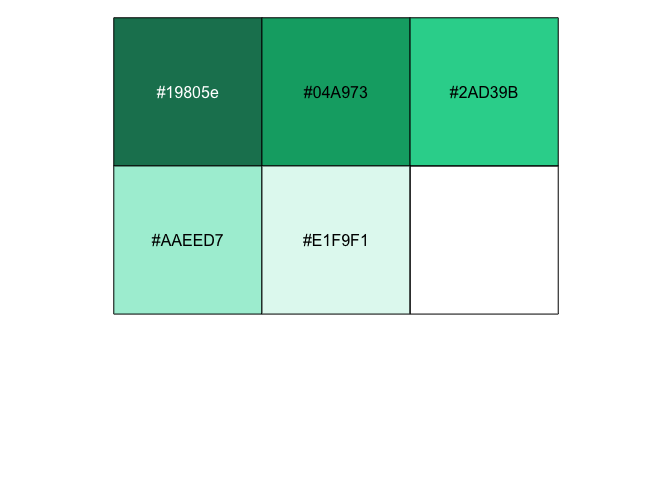
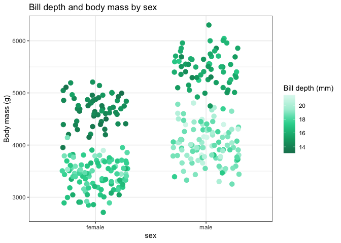
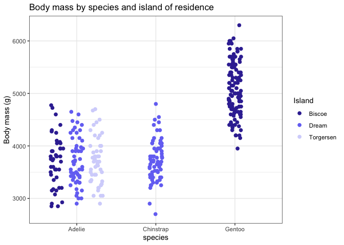
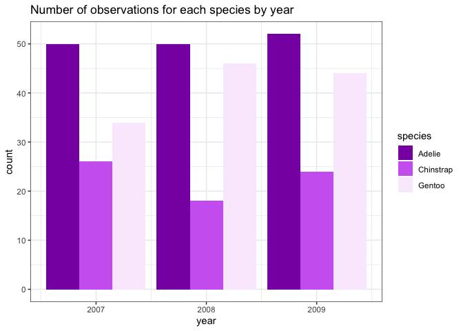
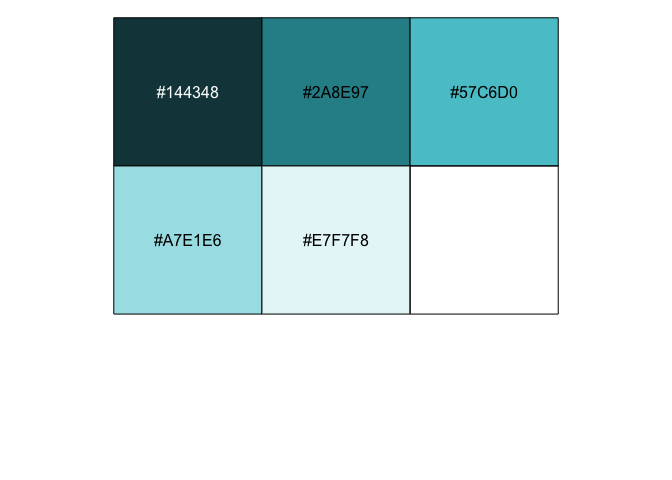
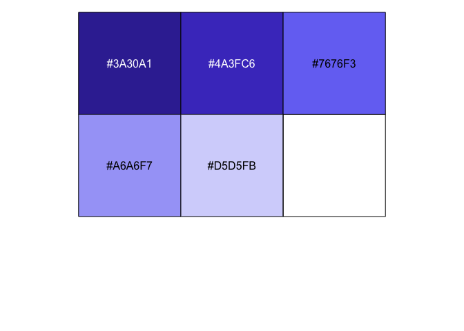
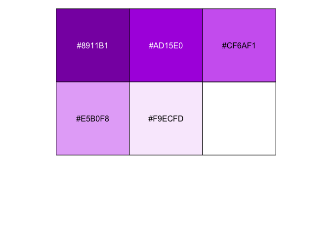
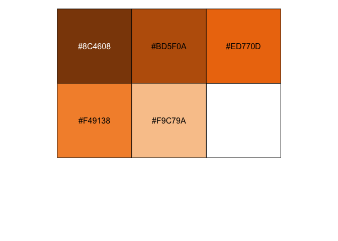
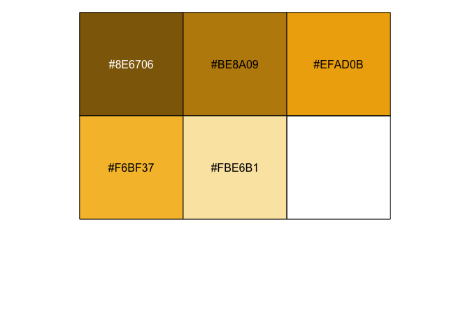

<!-- README.md is generated from README.Rmd. Edit README.Rmd and knit. -->

# twist-color-pal

Thematic Twist Bioscience color palettes for ggplot2 By Patrick Cherry

## Brief Description

The R package `twist_color_pal` provides the `ggplot2` functions
`scale_color_twist` and `scale_fill_twist` to automatically and flexibly
add Twist Bioscience brand colors to plots.

``` r
green_ngs_palette();
#>   NGS Green    UI Green Twist Green  Soft Green Light Green 
#>   "#19805e"   "#04A973"   "#2AD39B"   "#AAEED7"   "#E1F9F1"
scales::show_col(green_ngs_palette(), cex_label = 1)
```



## Installation

Use devtools or remotes to install from Twist Bioscience’s private
github. Twist’s Github is private, so use the [Personal access tokens
page](https://github.com/settings/tokens) to generate an access token
and paste it in between the quotes of `auth_token = ""` in the
`install_github()` command.

``` r
if (!require(devtools)) install.packages("devtools")
devtools::install_github("Twistbioscience/twist-color-pal", auth_token = "")
```

### Alternative installation

Alternatively, download the package zip and use devtools to install from
the local .zip.

``` r
if (!require(devtools)) install.packages("devtools")
devtools::install_local(path = "~/Downloads/twist-color-pal.zip")
```

## Examples

### Plots with generic data

``` r
penguins %>% 
  filter(!is.na(sex)) %>% 
  ggplot(aes(x = sex, y = body_mass_g, color = bill_depth_mm)) +
  geom_jitter(size = 3, width = 0.3) +
  scale_color_twist(discrete = FALSE) +
  labs(title = "Bill depth and body mass by sex",
       y = "Body mass (g)",
       color = "Bill depth (mm)")
```



``` r
penguins %>%
  filter(!is.na(sex)) %>%
  ggplot(aes(x = species, y = body_mass_g, color = island)) +
  geom_point(size = 2,
              position = position_jitterdodge(jitter.width = 0.4)) +
  scale_color_twist(palette = "purple_genes") +
  labs(title = "Body mass by species and island of residence",
       y = "Body mass (g)",
       color = "Island")
```



``` r
penguins %>%
  #filter(!is.na(sex)) %>%
  ggplot(aes(x = year, fill = species)) +
  geom_bar(position = position_dodge()) +
  scale_fill_twist(palette = "pink_biopharma") +
  labs(title = "Number of observations for each species by year")
```



## The Palettes

``` r
names(twist_palettes)
#> [1] "green_ngs"              "grays"                  "blue_oligo_pools"      
#> [4] "purple_genes"           "pink_biopharma"         "orange_variant_library"
#> [7] "golds"
```

``` r
grays_palette();
#>         Black Primary Slate      UI Slate   Medium Gray   Light Gray  
#>     "#0F0F10"     "#232E35"     "#354652"     "#98A8B3"     "#E0E5EB"
scales::show_col(green_ngs_palette(), cex_label = 1)
```


``` r
blue_oligo_pools_palette();
#>  Deep Teal       Teal Oligo Blue   Sky Teal Light Blue 
#>  "#144348"  "#2A8E97"  "#57C6D0"  "#A7E1E6"  "#E7F7F8"
scales::show_col(blue_oligo_pools_palette(), cex_label = 1)
```



``` r
purple_genes_palette();
#>   Sea Purple       Violet Genes Purple        Lilac Light Purple 
#>    "#3A30A1"    "#4A3FC6"    "#7676F3"    "#A6A6F7"    "#D5D5FB"
scales::show_col(purple_genes_palette(), cex_label = 1)
```



``` r
pink_biopharma_palette();
#> Fierce Magenta       Magenta  Biopharma Pink          Rose      Light Pink 
#>      "#8911B1"      "#AD15E0"      "#CF6AF1"      "#E5B0F8"      "#F9ECFD"
scales::show_col(pink_biopharma_palette(), cex_label = 1)
```



``` r
orange_variant_library_palette();
#>     Burnt Orange      Deep Orange           Orange Libraries Orange 
#>        "#8C4608"        "#BD5F0A"        "#ED770D"        "#F49138" 
#>      Pale Citrus 
#>        "#F9C79A"
scales::show_col(orange_variant_library_palette(), cex_label = 1)
```



``` r
golds_palette();
#>        Gold1        Gold2  Data Yellow       Yellow Light Yellow 
#>    "#8E6706"    "#BE8A09"    "#EFAD0B"    "#F6BF37"    "#FBE6B1"
scales::show_col(golds_palette(), cex_label = 1)
```



Questions? Concerns? Contact Patrick at <pcherry@twistbioscience.com>.
Did you use these to make nice plots? Did you present them? Let me know;
I’d love to hear. \<3
